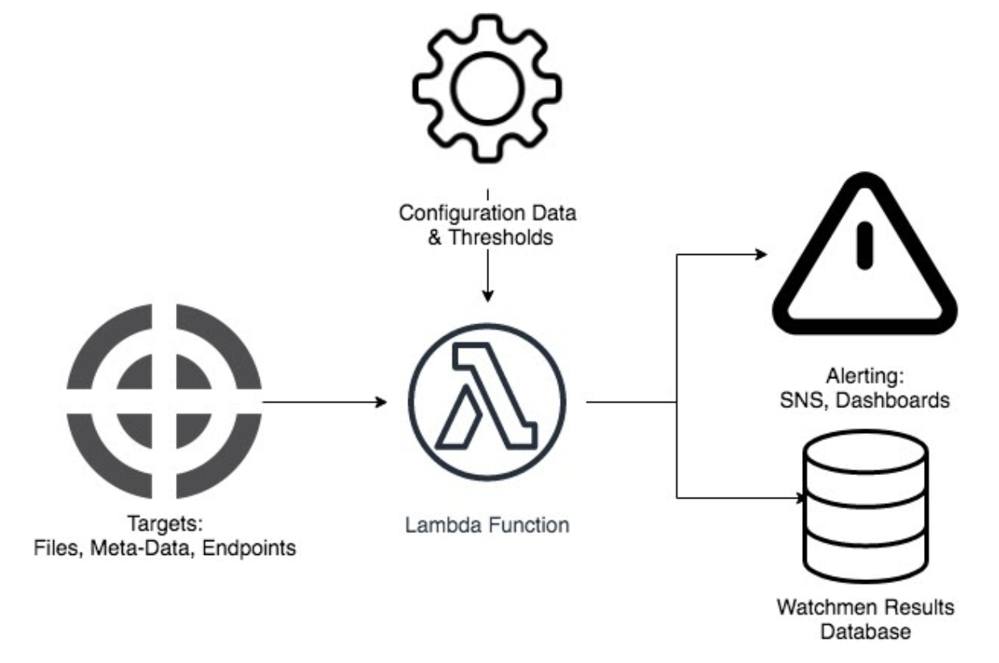
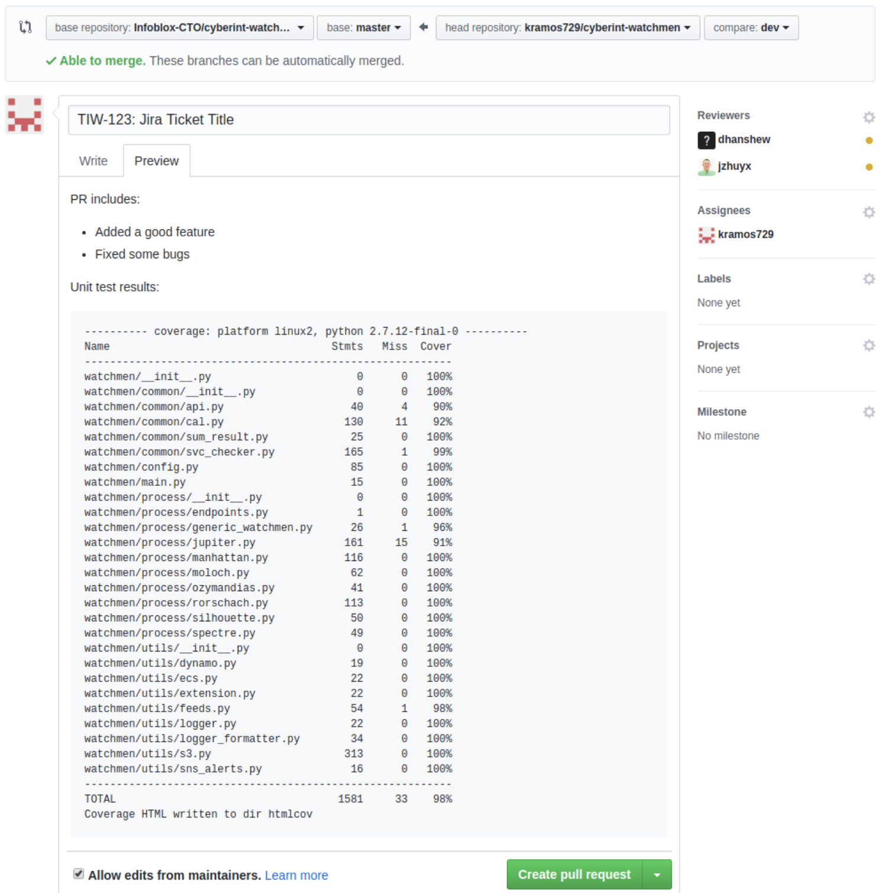
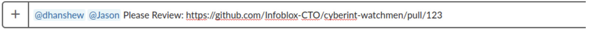
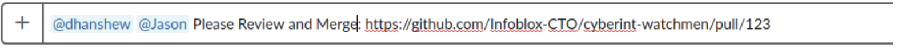

Table of Contents
=================

   * [Watchmen](#watchmen)
      * [Getting Started: Dev Setup](#getting-started-dev-setup)
      * [Testing](#testing)
      * [Watchmen Design Overview](#watchmen-design-overview)
         * [Logical Design](#logical-design)
         * [Watchmen Logical Components](#watchmen-logical-components)
         * [Legacy Watchmen Logical Components](#legacy-watchmen-logical-components)
      * [Developing a New Watchman](#developing-a-new-watchman)
         * [Getting the Project](#getting-the-project)
         * [Development](#development)
         * [Code Development](#code-development)
         * [Code Structure](#code-structure)
         * [Local testing of Watchmen](#local-testing-of-watchmen)
         * [Unit Testing](#unit-testing)
         * [Creating a Module or Helper Class](#creating-a-module-or-helper-class)
         * [Adding a New Config File](#creating-a-config-file)
         * [Adding a New SNS Topic](#adding-new-sns-topics)
         * [Adding Messages to messages.py](#adding-messages-to-messagespy)
         * [Adding Watchmen to <em>main.py</em>](#adding-watchmen-to-mainpy)
         * [Adding Watchmen to CloudFormation](#adding-watchmen-to-cloudformation)
         * [Cron Schedule Example Table](#cron-schedule-example-table)
         * [Creating a Pull Request](#creating-a-pull-request)
         * [Example Pictures for a Pull Request](#example-pictures-for-a-pull-request)
      * [Deployment](#deployment)
      * [Modifying a Watchman](#modifying-a-watchman)
        * [Change a Watchmans Schedule](#change-a-watchmans-schedule)
        * [Add a New Watchman Schedule](#add-another-schedule-for-a-watchman)
        * [Add a New Target to a Watchman](#add-more-checks-and-capabilities-to-a-generic-watchman)
            * [Bernard](#adding-emr-steps-to-bernard)
            * [Rorschach](#adding-s3-targets-to-rorschach)
            * [Comedian](#adding-apis-to-comedian)
            * [Manhattan](#adding-frindles-to-manhattan)

# Watchmen
The Watchmen project consists of a series of AWS Lambda functions that are configured to
monitor specific targets and alert the Cyber Intelligence team based on configurable criteria. 
The team both produces and consumes a variety of data and services that utilize Watchmen to
avoid silent failures, signify outages and metric anomalies, and allow members of the team to
remain updated at all times.

## Getting Started: Dev Setup
Running a dev-setup script to install the project and libraries
```
make clean dev-setup
```
IMPORTANT NOTE:\
You must have configurations for the Pypi server. This means you must
have a .pip configuration file and .pydistutils file in order to get the cyberint python 
packages.

## Testing
After running the previous command now you can start running unit tests on the current
code. To run all tests:

```
make test-all
```
or to start a clean test (you should do this before adding changes)
```
make clean test-all
```

After tests are completed you should see the results in the following format:

```
---------- coverage: platform linux2, python 2.7.12-final-0 ----------
Name                                   Stmts   Miss  Cover
----------------------------------------------------------
watchmen/__init__.py                       0      0   100%
watchmen/main.py                          11      0   100%
watchmen/manhattan_daily.py               31      0   100%
watchmen/manhattan_hourly.py              31      0   100%
watchmen/manhattan_weekly.py              31      0   100%
watchmen/moloch.py                        51      0   100%
watchmen/silhouette.py                    39      0   100%
watchmen/utils/__init__.py                 0      0   100%
watchmen/utils/universal_watchmen.py      74      0   100%
----------------------------------------------------------
TOTAL                                    268      0   100%
Coverage HTML written to dir htmlcov
```


To view individual test coverage go to
```
cyberint-watchmen/htmlcov/<YOUR_FILE> 
```
to view testing coverage.

## Watchmen Design Overview
The Watchmen project consists of a series of AWS Lambda functions that are configured
to monitor specific targets and alert the Cyber Intelligence team based on configurable
criteria.  The team both produces and consumes a variety of data and services that
utilize Watchmen to avoid silent failures, signify outages and metric anomalies, and
allow members of the team to remain updated at all times.

### Logical Design
All Watchmen use the same simple logical concept with five generic components:
the **target**(s) to be observed, the **configuration data**, the **Lambda** execution process,
the **alerting mechanisms**, and finally the **results database** which captures the
details of every execution.


### Watchmen Logical Components
*Standardized Generic Watchmen Class*
  - **Targets:**  Each Watchman monitors at least one unique target, which has its own AWS
    Simple Notification Service (SNS) topic(s). Targets are usually files, endpoints, or
    entries in a database. Targets should be defined in configuration files within the
    project. They are usually located on AWS but can be located on-premises.
  - **Configuration Data and Thresholds:** Configurations and thresholds are set based on
    each target. Targets with values within the threshold(s) are considered successes,
    while targets with values outside of the threshold(s) are considered failures.
    Threshold examples include the number of files, the number of submissions to a
    feed within a minimum and maximum, and the existence of a file on S3.
  - **Lambda Function:** As of now, the names of the Watchmen derive from the AWS
    CloudFormation stack and the individual name of the module. For example, the
    following is the name of the Manhattan Watchman: **CyberInt-watchmen-prod-Manhattan**
    - **CyberInt-watchmen-prod**: CloudFormation stack name
    - **Manhattan**: Lambda name
    - Each Lambda is fired off depending on its [Cron schedule](https://docs.google.com/document/d/1to0ZIaU4E-XRbZ8QvNrPLe430bWWxRAPCkWk68pcwjE/edit#heading=h.pnipc487qe08). Some may be scheduled
      every hour while others may be scheduled once a week.
  - **Alerting:** All alert mechanisms are sent via SNS for specific team members that
    relate to the service that has an issue. These email notifications follow a standard
    template with the subject notifying the user about which Watchman is having the issue
    and the body detailing the issue in further detail. Some of the Watchmen send an SMS
    message for more critical systems. In the future, notifications may be handled using
    a perspective on Sockeye with health status of the current services.
  - **Watchmen Results Database:** This database holds the results of every check from each
    Watchman. **Currently in design. More information will be added later**
    
### Legacy Watchmen Logical Components
*Proprietary Watchmen Class*
  - **Main()**: This function contains the business logic of the Watchmen.
  - **Various methods to gather results:** These are all the methods needed for the
    Watchman to accomplish its purpose.
  - **SummarizedResult():** This function puts all notification information inside of a
    dictionary and other key-value pairs you deem valuable. This function is primarily
    used for notification purposes, but it should contain all the information that you
    want returned after the monitoring process.
  - **Notify():** This function utilizes a Watchman’s SNS topic to send an individualized alert
    message.


## Developing a New Watchman

### Getting the Project
Before designing and creating a Watchman, you must get the project from GitHub.
1. Go to the Watchmen repository: https://github.com/Infoblox-CTO/cyberint-watchmen.
2. Fork the repo by clicking “Fork” on the upper right. Now you should have your own Watchmen repo!
3. The README will contain all the instructions to set up your environment including prerequisites.
4. Now you should create a branch called ‘dev’. Dev is where you will spend your time developing Watchmen.

### Development
Before you jump straight into coding, it is a great idea to draw out a design and write pseudocode for your Watchman.
Make sure you check out the
[Watchmen Design Overview](https://docs.google.com/document/d/1to0ZIaU4E-XRbZ8QvNrPLe430bWWxRAPCkWk68pcwjE/edit#heading=h.xkj4w49c3gzt) before getting started.
It is also recommended to grab a Cyberintel Dev and go over your design to finalize it.
All the Watchmen are named after characters from the comic and television series *Watchmen*,
so if you are unfamiliar with the series, please choose a name from the character list
[here](https://en.wikipedia.org/wiki/List_of_Watchmen_characters).
Once you have a design and a name, it is time to start coding.

### Code Development
Once you’re ready to start coding, open your text editor and find the project structure.
In *watchmen/process/*, create a python file called {WATCHMAN NAME}.*py*.
This is the file where you will create your Watchman. Use the code structure below to 
create a Watchman that looks and acts like the others that already exist.

### Code Structure
Each Watchman utilizes the Watchman interface, along with the Result and ResultSvc classes.
  - Watchman: *cyberint-watchmen/watchmen/common/watchman.py*
    - All Watchmen **must** use this interface. The Watchman you create **must** be a child class
      that inherits from the Watchman parent class.
    - The Watchman class must implement a monitor method which returns a list of Result
      objects. The monitor method acts as the main method and should contain the business
      logic of the Watchman’s monitoring process. The class signature should look like the following:
```
class {WATCHMAN_NAME}(Watchman):
```
  - Result: *cyberint-watchmen/watchmen/common/result.py*
    - This class contains all the properties of a check from a Watchman. A list of Result
      objects must be returned at the end of a check. These objects are used to build notifications, 
      end notifications, display a summary on AWS, and, eventually, persist to the Watchmen database.
    - A Result object contains 11 attributes:
      - **details:** Lengthy details of the notification or alert
        - This attribute is primarily used for SNS email alerts.
      - **disable_notifier:** Whether or not a notification should be disabled
        - Most Watchmen do not send notifications upon success.
      - **dt_created:** The datetime timestamp when the result was created
        - The datetime timestamp when the result was created
      - **result_id:** The ID of a result
        - This attribute is currently not in use. It is intended for the Watchmen database.
      - **short_message:** A simple message for short notifications
        - This attribute is primarily used for SNS text alerts.
      - **snapshot:** The runtime context (JSON object) of the target
        - Configuration details of the check
      - **state:** The status of the check. It can only be one of the following:
        - SUCCESS: The check found no outages or issues.
        - EXCEPTION: An exception occurred and prevented the check from continuing.
        - FAILURE: The check found outages or issues.
        - RECOVERED: Not in use. It will signify that someone manually recovered the failure or exception. 
      - **subject:** The subject line for the notification
      - **success:** Indicates if the check resulted in a SUCCESS state.
      - **target:** The specific target the source is checking
        - Some Watchmen monitor multiple targets.
      - **watchman_name:** The Watchman the result came from
  - Notifier: *cyberint-watchmen/watchmen/common/sns_notifier.py*
    - This class implements the Notifier interface which requires the send_alert
      method to be implemented. sends the notification.
    - NOTE: There is a separate notifier in
      *cyberint-watchmen/watchmen/common/notifier.py*, but it is intended for non-AWS
      notifications. As of now, all Watchmen use AWS for their notifications, so they use the sns_notifier.

The Result and Notifier interfaces utilize a connection interface called ResultSvc.
  - ResultSvc: *cyberint-watchmen/watchmen/common/result_svc.py*
    - This class processes a list of Result objects, and, using factory design,
      it generates Notifier objects and SNS topics by reading the target attribute.
      This class is also responsible for creating the message that is returned to the lambda,
      which includes errors, failures, and successes of each Watchman monitor method.
    - The prod SNS topic for each target is in
      *cyberint-watchmen/watchmen/common/notifiers-prod.json.*
      
### Local testing of Watchmen
To test locally, place the following code at the bottom of your Watchman file:
```
if __name__ == '__main__':
      spectre_obj = Spectre(None, None)# If your Watchman uses an event or context,
please replace “None” with the appropriate replacement. Replace Spectre with watchman class name.
      results = spectre_obj.monitor()
      for result in results:
            print(result.to_dict())
# If you want to test the email alerts, you will need to add the code below.
      from watchmen.common.result_svc import ResultSvc
      result_svc = ResultSvc(results)
      result_svc.send_alert()
      print(result_svc.create_lambda_message)
```
Before trying to test locally, make sure you are subscribed to the SNS topic **Watchmen_Test**.
If you have not yet subscribed to this topic, follow the steps below:
  1) Go to the AWS console and select “Services”.
  2) Find “Simple Notification Service” by either using the search bar or looking under
     “Application Integration”.
  3) On the left side column, select “Topics”.
  4) Search for “Watchmen_Test” and select it.
  5) View the list of subscriptions. If your email is not there, you can subscribe
     by clicking the orange “Subscribe” button.
  6) Click the drop down tab for “Protocol” and choose email or whichever means of notification
     you want.
  7) Now, your name should appear on the subscription list.
  
  NOTE: You can follow these same steps to subscribe to any topic, not just Watchmen_Test.

If you accidentally send a notification to a production topic, send a message in the
cyberint-watchmen Slack channel with an “@channel” tag, so everyone knows to disregard
that notification. Those who are subscribed to the Watchmen_Test topic are aware that
they may receive test emails at any time, so do not worry about writing a follow-up
when using the test topic

### Unit Testing
As you create your Watchman, it is essential to have unit tests. You should name your
unit test file *test*_{WATCHMAN NAME}.*py* and create it in *tests/*. The Watchmen project 
must have 95% code coverage at minimum. It is recommended to write a method/function, then
write the unit tests for it, and continue to do this until your program is complete.

### Creating a Module or Helper Class
If you need to create a module or helper class, you need to determine if it should go in
*watchmen/common* or *watchmen/utils*. The path *watchmen/utils* is meant for a collection
of unrelated functions that some Watchmen use while *watchmen/common* is for related
functions that many Watchmen use. The helper class you create also requires unit tests.
In *tests/*, create a python file called *test_*{FOLDER}_{CLASS FILE NAME}.*py* where
“FOLDER”refers to whether it is in *util* or *common*.

### Creating a Config File
If you need to make an additional configuration file for your watchmen, place the config file in 
watchmen/process/configs.

### Adding new SNS Topics
If your Watchman uses new SNS topics, make sure to add the target name with the SNS topic to `notifiers-prod.json`.
Add just your target name with the SNS topic `arn:aws:sns:us-east-1:405093580753:Watchmen_Test` to `notifiers-test.json`
The target name is the name which you pass into the target attribute when you create a response object.

### Adding Messages to messages.py
The messages for the Watchmen you are developing should be put in messages.py and must be
inserted in alphabetical order. These messages can be imported in your Watchmen file using,
```
from watchmen import messages
```

### Adding Watchmen to *main.py*
To prepare for deployment, you need to make a few file changes to the project’s main
method, which can be found in:
- cyberint-watchmen/watchmen/main_atg.py
- cyberint-watchmen/watchmen/main_cyberintel.py
- cyberint-watchmen/watchmen/main_saas.py

Use the file that corresponds to the accounts in which your Watchman will run. All the Watchmen follow a similar 
template, so your Watchman should look like the following:
```
def start_<NAME>_watchman(event, context):
   “”"
   Start <NAME> watchman to monitor <TARGET SUMMARY>.
   :return: The context that the code is being run in.
   “”"
   <NAME> = <WATCHMAN OBJECT NAME>(event, context)
   results = <NAME>.monitor()
   result_svc = ResultSvc(results)
   result_svc.send_alert()
```

1) Add another method called ‘start_{WATCHMAN NAME}_watchman’ and insert the method
alphabetically. Give it a doc comment that simply describes which process is about to start.

NOTE: All these methods are extremely similar, so look at others to match the pattern.

2) The file *watchmen/main.py* has a unit test located in *tests/test_main.py.* You will
need to add a test for the method you created in the above step to maintain code coverage.

### Adding Watchmen to CloudFormation
Next, you need to make some additions to `cloudformation/cf_{AWS_Account}.yaml`.
You need to add information in three different places under the “Resources” key.
1) Add your Watchman’s Lambda information.
```
 Watchmen<NAME>Lambda:
    Type: 'AWS::Lambda::Function'
    Properties:
      Runtime: python3.7
      Code:
        S3Bucket: !FindInMap [EnvMap, !Ref Env, Bucket]
        S3Key: !Join ["/", [!Ref BuildsPrefix, !FindInMap [EnvMap, !Ref Env, BuildFile]]]
      Description: <WATCHMAN’S DESCRIPTION>
      Handler: handler.start_<NAME>_watcher
      MemorySize: 256
      Role: !GetAtt <NAME>LambdaExecutionRole.Arn
      Timeout: 30
      Tags:
        - Key: Owner
          Value: CyberIntel
        - Key: Product
          Value: watchmen
        - Key: Protected
          Value: 'TRUE'
        - Key: Component
          Value: lambda
        - Key: Name
          Value: watchmen-<NAME>
        - Key: Env
          Value: !Ref Env
```
2) Add your Watchman’s cron job/scheduled event.
```
<NAME>ScheduledEvent:
    Type: 'AWS::Events::Rule'
    Properties:
      Description: A <SCHEDULE> event that kicks off <NAME>Watchman
      ScheduleExpression: cron(40 11 * * ? *)   ← This is purely an example and further
      explanation and examples of cron formatting can be found[here](https://docs.google.com/document/d/1to0ZIaU4E-XRbZ8QvNrPLe430bWWxRAPCkWk68pcwjE/edit#heading=h.pnipc487qe08). 
      State: ENABLED
      Targets:
        - Id: <NAME>Scheduler
          Arn: !GetAtt Watchmen<NAME>Lambda.Arn
```
3) Add your Watchman’s Lambda permissions.
```
 Invoke<NAME>LambdaPermission:
    Type: 'AWS::Lambda::Permission'
    Properties:
      FunctionName: !GetAtt Watchmen<NAME>Lambda.Arn
      Action: 'lambda:InvokeFunction'
      Principal: events.amazonaws.com
      SourceArn: !GetAtt <NAME>ScheduledEvent.Arn
```
4) Add your Watchman's IAM Role. When creating the Role, assign only the permissions needed for your
Watchman to run. The example below is a basic role with the permission's to publish to one topic and retrieve information
that has been encrypted by AWS.
```
 <NAME>LambdaExecutionRole:
      Type: 'AWS::IAM::Role'
      Properties:
        RoleName: !Sub <NAME>LambdaExecutionRole-${Env}
        AssumeRolePolicyDocument:
          Statement:
            - Effect: Allow
              Principal:
                Service:
                  - lambda.amazonaws.com
              Action:
                - 'sts:AssumeRole'
        ManagedPolicyArns:
          - !Sub "arn:${AWS::Partition}:iam::aws:policy/service-role/AWSLambdaBasicExecutionRole"
        Policies:
          - PolicyName: !Sub <NAME>LambdaExecutionRole${Env}
            PolicyDocument:
              Statement:
                - Effect: Allow
                  Action:
                    - "kms:Decrypt"
                  Resource: !Sub "arn:${AWS::Partition}:kms:${AWS::Region}:${AWS::AccountId}:key/${KmsKeyId}"
                - Effect: Allow
                  Action:
                    - 'SNS:Publish'
                  Resource:
                    - !Sub
                      - "arn:${AWS::Partition}:sns:${AWS::Region}:${AWS::AccountId}:${Topic}"
                      - { Topic: !If [IsProd, <Watchman's Topic>, Watchmen_Test] }

```
To add a new permission to your IAM Role, add a statement into the statement section of the Role. It will
have the format:
```
- Effect: Allow
  Action:
  - <Permssion>
  Resource: (AWS resource the permission will act on)
```
For more information on permissions, resources, or Cloudformation visit AWS's documentation.
- https://docs.aws.amazon.com/IAM/latest/UserGuide/reference_policies_actions-resources-contextkeys.html
- https://docs.aws.amazon.com/IAM/latest/UserGuide/reference_policies_elements_action.html

There are plenty of existing examples in the CloudFormation file, so please
use them as resources.

NOTES: 
- Steps 1-4 are required. If your Watchman requires new/special permissions, such as access to a 
Virtual Private Cloud (VPC), make sure to add it properly to the CloudFormation. For example, the Jupiter
Watchman uses a security group; therefore, it has additional Lambda properties that
the other Watchmen do not require.

- Right now, every Watchman will need at least the `kms:Decrypt` and `SNS:Publish` permissions. The `kms:Decrypt`
permission will always act on the `arn:${AWS::Partition}:kms:${AWS::Region}:${AWS::AccountId}:key/${KmsKeyId}` resource,
and `SNS:Publish` permission will act on both the `Watchmen_Test` and your Watchman's prod SNS topics.


5) Add your Watchman’s Security Group
  - Jupiter is the only Watchman that uses a Security Group at the moment. It is
    needed to use the Cyber-Intel VPC in order to hit the internal endpoints.
```
<NAME>SecurityGroup:
    Type: AWS::EC2::SecurityGroup
    Properties:
      GroupDescription: Security group that allows <DESCRIPTION>
      GroupName: !Join ['-', [!Ref "AWS::StackName", <NAME>SecurityGroup]]
      SecurityGroupEgress:
        - IpProtocol: -1
          FromPort: -1
          ToPort: -1
          CidrIp: 0.0.0.0/0     ← This means egress to anything. For Jupiter, this
          allows access to write to S3 while in the Cyber-Intel VPC. Egressing to
          anything is a secure practice, but DO NOT allow ingress from anything!
      Tags:
        - Key: Owner
          Value: CyberIntel
        - Key: Product
          Value: watchmen
        - Key: Protected
          Value: 'TRUE'
        - Key: Component
          Value: lambda
        - Key: Name
          Value: watchmen-<NAME>
        - Key: Env
          Value: !Ref Env
      VpcId: !FindInMap [EnvMap, !Ref Env, VPC]
```
 6) Add cloudformation files for other AWS environments.
  - Rorschach is the only Watchman that exists in multiple AWS accounts (saas and atg) at the moment. If your new 
  Watchman exists within multiple AWS accounts, then you will most likely need separate cloudformation template files 
  for each account. The main reason for creating separate cloudformation template files for separate AWS accounts is
  to prevent permission/access issues that occur if you try to access AWS items from a different account.  

 7) To test your cloud formation syntax run the following command in a terminal with your AWS credentials:
 ```
aws cloudformation validate-template --template-body file://cloudformation/cf_<aws_account>.yaml
 ```

### Cron Schedule Example Table
Cron schedules are used by every Lambda to determine when they are to be fired off.
This schedule is quite customizable, and each Watchman has a unique Cron schedule,
which allows for an easy, automated process.

Below are examples of pre-formatted cron schedules. You can also go to this [link](https://docs.aws.amazon.com/AmazonCloudWatch/latest/events/ScheduledEvents.html)
to learn more about cron.

cron(Minutes Hours Day-of-Month Month Day-of-Week Year) NOTE: UTC timezone

| **Cron Expression**       | **Frequency**                                                   |
| ------------------------- | --------------------------------------------------------------- |
| cron(0 15 * * ? *)        | Everyday at 3:00 p.m.                                           |
| cron(0 8 ? * TUE *)       | Every Tuesday at 8:00 a.m.                                      |
| cron(30 7 3 * ? *)        | Every month on the 3rd at 7:30 p.m.                             |
| cron(* * * * * *)         | Every minute                                                    |
| cron(22 2 ? * 5#2 *)      | Every second Thursday of every month at 2:22 a.m.               |
| cron(0 18 1/14 * ? *)     | Every 14 days at 6:00 p.m. (twice a month)                      |
| cron(0 4 * * THU-SAT *)   | Every Thursday through Saturday at 4:00 a.m.                    |
| cron(45 14 * 6 WED *)     | Every Wednesday in June at 2:45 p.m.                            |
| cron(0 21 13,20 5,12 ? *) | Every 13th and 20th of May and December at 9:00 p.m.            |
| cron(30 17 ? * 1L *)      | The last Sunday of every month at 5:30 p.m.                     |
| cron(0/20 6-21 ? * * *)   | Every 20 minutes between 6:00 a.m. and 9:00 p.m.                |
| cron(0 0 8W * ? 2019)     | The eighth weekday of every month in the year 2019 at midnight. |


### Creating a Pull Request
Now that you have a Watchman with working unit tests, you need to create a Pull
Request from your branch and have it approved to merge into upstream master.
Below is the process for creating a Pull Request:
1) Open a Pull Request for the branch you want to merge into, 
infoblox-CTO/cyberint-watchmen master.
2) The title should be the corresponding VersionOne ticket ID and is sometimes
followed by a more specific title that describes the Pull Requests’s purpose. Examples:
    - TIW-75: Refactoring Watchmen - Refactored Rorschach
    - TIW-60: Create Watchmen for Georgia Tech Feed
3) In the summary, add a line saying “PR includes:” and below it, use bullets to add the
key points for this PR. Also add a line saying “Unittest results:” and below that, add
the unit test results that are produced on the CLI when you run the command `make test-all`.
4) On the right-side column, add reviewers and add yourself as the assignee. Reviewers
are the people you want to look at, add comments and suggestions, and eventually
approve your Pull Request. 
5) Once you have created the Pull Request, go to the cyberint-watchmen Slack channel and
send a message tagging the people you assigned as reviewers telling them you created a
PR and want their review and the link for the newly created Pull Request.

### Example Pictures for a Pull Request

Github Pull Request


Review Slack Message


Review and Merge Slack Message


## Deployment
The deployment process may vary depending on what code changes were made. If changes are made to the cloudformation 
template, or code changes modify the core functionality of a Watchman, then a cloudformation stack update is required.

If changes are only done to config files that exist in S3, such as the `feeds_to_check.json` file for Manhattan, then a 
cloudformation deployment is not required. Updates to S3 config files should be done through a makefile command. 
Available commands are:
- `make deploy-feeds-to-check-<ENV>`
- `make deploy-endpoints-<ENV>`

You are ready to deploy your Watchman if:
- Your Watchman is running as expected 
- You have unit tests with 95% coverage
- The corresponding CloudFormation file has been updated,
- You updated main_<AWS_Account>.py
- Any new SNS topics have been added to `notifiers-test.json` and `notifiers-prod.json`
- Your Pull Request was approved and merged

It is time to deploy your Watchman!

Deployments can, and often times are, run using makefile commands.

Before deploying to prod, a test deployment should take place. All test deployments should be done within the atg AWS 
account.

**Steps to Deploy a Watchman to Production:**
1) Make a Planned Maintenance email covering when the deployment is (Deployments are only done on Tuesdays and Thursdays.), 
what will be updated, the risk level, steps to take, and rollback steps. Then, send it to DL Cyberint at least one day in 
advance. 
2) On the day of deployment, make sure to pull the new changes to your master branch. Then, in cyberint-watchmen/, run:

    `make deploy-<AWS_Account>-<ENV>`
    
    ENV: `prod` or `test`\
    AWS_Account: `atg`, `cyberintel`, `saas`

NOTE: After this command runs,  it creates a ZIP file containing the entire Watchmen project and puts it on S3 in 
`{AWS_Account_Bucket}/watchmen/builds/{DATE}_{COMMIT HASH}`. The bucket can change depending on the AWS_Account you 
deploy to. These are the buckets: \
atg:
- cyber-intel-test
- cyber-intel 

cyberintel:
- cyberintel-test
- cyber-intel-prod 

saas:
- cyber-intel-saas-test
- ib-cyberint-prod-deploys

In the terminal, you should see an outputted command that looks similar to this:
```
aws cloudformation update-stack
   --capabilities CAPABILITY_NAMED_IAM
   --stack-name CyberInt-watchmen-test
   --parameters ParameterKey=Env,ParameterValue=test ParameterKey=BuildsPrefix,ParameterValue=watchmen/builds/20190722_ba08ae8
   --template-body file://cf_atg.yaml
```
If you do not have enough permissions, ask DevOps to run the above command on the day of deployment.
If you need help from DevOps, make a ticket for DevOps asking to have a scheduled deployment for the date and time of 
your choosing. This ticket should be made at least 3-5 days ahead of the planned deployment! Ask them to run the outputted 
command and make sure to attach the cf_{AWS_Account}.yaml file. You need to ask them to run the outputted command on the 
correct account. 

If the deployment does not go as planned and needs to roll back, ask your DevOps standby to run the following command 
with the correct build: 
```
aws cloudformation update-stack
   --capabilities CAPABILITY_NAMED_IAM
   --stack-name CyberInt-watchmen-test
   --parameters ParameterKey=Env,ParameterValue=test ParameterKey=BuildsPrefix,ParameterValue=watchmen/builds/{BUILD_ZIP}
   --template-body file://cloudformation.yaml
```

## Modifying a Watchman

### Change a Watchman’s Schedule

Ex) Someone wants to change a schedule from daily to monthly. What do they do?

If someone needs to modify a Watchman’s current monitoring schedule, they must go to cloudformation/cf_{AWS_Account}.yaml 
and find that specific Watchman’s ScheduledEvent. If they are unsure of what that looks like, they should go
[here](#adding-watchmen-to-cloudformation) and scroll down to `2) Add your Watchmen’s cron job/scheduled event`
because it is a good template. They should find the “ScheduleExpression” key and change the cron schedule to what they desire. 
They should use this example [table](#cron-schedule-example-table) for format help.

### Add Another Schedule for a Watchman
Ex) Someone wants to change a daily schedule to daily AND monthly. What do they do?

If a Watchman’s current monitoring schedule is sufficient but an additional schedule is desired, the Watchman will 
require another ScheduledEvent in cloudformation/cf_{AWS_Account}.yaml. The code to add this ScheduledEvent can be found 
[here](#adding-watchmen-to-cloudformation). They should scroll down to `2) Add your Watchmen’s cron job/scheduled event.` 
When a Watchman has multiple ScheduledEvents, the names of the ScheduledEvents should include their schedule type. For example, 
WatchmanDailyScheduledEvent or WatchmanMonthlyScheduledEvent state their schedule type. Both ScheduledEvents use the 
same Lambda function in CloudFormation. They should use this example [table](#cron-schedule-example-table) for cron scheduling help.

### Add more checks and capabilities to a generic Watchman
**Current Generic Watchmen:**
- [Bernard](#adding-emr-steps-to-bernard) (EMR Steps Monitor) 
    - Account: atg-infoblox
- [Rorschach](#adding-s3-targets-to-rorschach) (S3 Monitor) 
    - Account: atg-infoblox, saas-infoblox
- [Comedian](#adding-apis-to-comedian) (Api Quota Tracker)
    - Account: atg-infoblox
- [Manhattan](#adding-frindles-to-manhattan) (Frindle Monitor)
    - Account: atg-infoblox
    - Note: Only monitors frindles in ECS Cluster cyberint-feed-eaters-prod

#### Adding EMR Steps to Bernard
**Config File:** watchmen/process/configs/emr_clusters_to_check.json

To add a new EMR cluster for monitoring steps, add a dictionary to the `step_clusters` list in the config file with the name of 
the cluster. It would look something like this:
```
{ 
    "cluster_name": "your-cluster-name"
}
```

#### Adding S3 Targets to Rorschach
**Config Files:** 
- watchmen/process/configs/s3_targets_atg_prod.yaml
- watchmen/process/configs/s3_targets_saas_prod.yaml

To add a new target for Rorschach to monitor, add the `target_name` with the correct tags under the check frequency tag 
(`Hourly` or `Daily`) then add the file(s) to be checked under an `items` tag. The `target_name` will correspond to the 
Response object target. If a new target is added, the `target_name` should also be added to 
`watchmen/common/notifiers-test.json` and `watchmen/common/notifiers-prod.json` with its corresponding SNS topic.


**Target Tags**:

- **bucket_name**: \<String> the name of the S3 bucket the file(s) will be in.
    - Required for all checks.
- **full_path**: \<String> the exact path to check for single file existence.
    - Required for single file checks.
- **min_total_files**: \<Integer> the minimum amount of total objects expected.
    - Optional for multiple files checks.
- **min_total_size_kb**: \<Integer> the minimum total file size expected
    - Optional for single file and multiple files checks.
- **prefix**: \<String> the S3 prefix the files are in.
    - Required for multiple files checks.
- **suffix**: \<String> the expected suffix each file in the S3 bucket and prefix should have.
    - Optional for multiple files checks.
- **time_offset**: \<Integer> the amount of time to go back for the existence check. The counter will be whatever the event type is. For example, a time_offset of 2 for Daily events will look at files from 2 days ago.
    - Optional for single file and multiple files checks.
- **whitelist**: \<List<String>> whitelisted files that should not be considered while performing the checks.
    - Optional for multiple files checks.
    
A multiple file entry might look like this:

```
Daily
    - target_name: DS Summaries
      items:
        - bucket_name: cyber-intel
          prefix: prefix/year=%0Y/month=%0m/day=%0d/
          suffix: .parquet
          whitelist: ['_SUCCESS']
        - bucket_name: cyber-intel
          prefix: prefix/src=customer/year=%0Y/month=%0m/day=%0d/
          suffix: .parquet
          whitelist: ['_SUCCESS']

```

#### Adding API's to Comedian
**Config File:** watchmen/process/configs/api_targets.yaml

Note: Store new API keys at watchmen/config.yaml with the tag `{target_name}_api_key`

To add a new API to Comedian:

1) Add a new entry to the config file. Below are the tags:

- **target_name**: \<String> The name of the API target.
    - Required
- **threshold_start**: \<Integer> The start threshold percentage at the beginning of the month.
    - Required
    - Ex: 50
- **increment**: \<Integer> Percentage to increment the quota threshold daily.
    - Required
    - Ex: 2
- **hash**: \<String> If you will need a signature for your get request, specify the hashing algorithm here.
    - Optional
    - Possible Values: sha1, sha256
- **encode**: \<String> If you will need a signature for your get request, specify how to encode the strings here.
    - Optional
    - Ex: utf-8
- **timestamp**: \<String> If your url or request signature will require a timestamp, enter the stamp format here.
    - Optional
    - Note: Must have `''`
    - Ex: '%Y-%m-%dT%H:%M:%SZ'
- **head**: \<None> This is a tag to establish get request header data. This is only needed if you need to customize the 
                     request header.
    - Optional
    - Sub Tags:
        - **{head-tag-name}**: \<String> If there needs to be a special head tag and value pair, add the header tag name as 
                                     the config tag and the header value as the config value. If an api key is the value,
                                     then enter `apikey` as the value and the comedian will assign it.
            - Optional
            - Possible Values: apikey(will insert the apikey into the header), 
                               timestamp(will insert the timestamp), 
                               Any other value you choose
            - Ex: `MYHeaderTag: ohaheadertag`
        - **signature**: \<None>If a signature is needed in the request header, provide the information under this tag.
            - Optional
            - Sub Tags:
                - **tag**: \<String> The Header tag name associated with the signature.
                    - Required
                - **api_key** (or) **key**: \<String> If the signature requires an api key as the signature key, use `api-key` 
                                                and enter the api key in the cyberint-watchman config file. If the 
                                                signature key is not an api key, use `key` and put in the key as the 
                                                value in this config.
                    - Required                                       
                - **msg**: \<None> This is to mark the pieces of the message which will be combined, encoded with the 
                                 `encode` tag, then signed with the key above for the signature.
                    - Required
                    - Sub Tags:
                        - **timestamp**: \<None> If a timestamp is needed make sure you have already assigned the 
                                               `timestamp` tag. This tag will automatically enter in the timestamp with 
                                               the format previously established.
                            - Optional
                        - **{attr_name}**: \<String> This will establish the message to be combined. The tag name is 
                                                   arbitrary and the values will be combined for the signature message.
                            - Required
                            - Note: There can be as many of these tags as needed.
    - Ex:
        ```
          head:
            MYHeaderTag: timestamp
            signature:
               tag: thisasignature
               key: ooosupersecretkey
               msg:
                 MSG1: IamFirst
                 MSG2: IamSecond
        ```  
- **url**: \<String> The url to send the request to. If there are arguments in the url, add them in the url like this
                       `{argument-name}`.
    - Required
    - Ex: url.com/{argument-name}
- **url_arguments**: \<None> If the url has arguments, establish them under this tag with matching names.
    - Optional
    - Sub Tags:
        - **timestamp**: \<None> will add a timestamp into the url argument named timestamp
            - Optional
        - **signature**: \<None> Will add a signature into the url argument named signature
            - Optional
            - Sub tags: Must be configured in the same way as stated above
        - **{url-argument-name}**: \<Any> argument value
            - Optional
    - Ex:
        ```
        url: http://api.domaintools.com/v1/account?api_username={username}&signature={signature}&timestamp={timestamp}
        url_arguments:
            username: user
            signature:
              api_key:
              msg:
                username: user
                timestamp:
                uri: uri
            timestamp:
        ```
- **quotas**: \<None> List all quota names to be tracked below in the format `- {quota-name}`
    - Required
    - Ex:
        ```
        quotas:
          - whois
          - whois-history
          - reverse-ip
          - reverse-name-server
          - reverse-whois
          - domain-search
          - hosting-history
          - mark-alert
          - registrant-alert
        ```

2) Add the `_get_{target-name}_data()` function. Its purpose will be to perform a get request and format that response.
   Here is a template for the method:
   ```
    def _get_{target-name}_data(self, api):
        header, tb = self._build_header(api)
        if tb:
            return None, tb
   
        url, tb = self._build_url(api)
        if tb:
            return None, tb
   
        try:
            api_response = requests.get(url=url, headers=header).json()
            quotas = api_response["path"]["to"]["quotas"]
        except Exception as ex:
            self.logger.info("ERROR in VirusTotal GET Request")
            self.logger.info(const.MESSAGE_SEPARATOR)
            self.logger.exception("{}: {}".format(type(ex).__name__, ex))
            tb = traceback.format_exc()
            return None, tb
   
        formatted_data, tb = self._create_data_template(api)
        if tb:
            return None, tb
   
        api_quotas = api['quotas']
        for quota in quotas:
            if quota in api_quotas:
                #add quota usage and name to the formatted_data dictionary
        return formatted_data, None
   ```
   
   The return of this method should be in the form:
   ```
   {
            'threshold_start': 26,
            'increment': 2,
            'quotas': {'api_requests_monthly': {'used': 311, 'allowed': 1000000000},
                      'intelligence_downloads_monthly': {'used': 0, 'allowed': 300},
                      'intelligence_hunting_rules': {'used': 20, 'allowed': 20000},
                      'intelligence_retrohunt_jobs_monthly': {'used': 0, 'allowed': 5},
                      'intelligence_searches_monthly': {'used': 21, 'allowed': 300}}}
   }
   ```
#### Adding Frindles to Manhattan
**Config File:** watchmen/process/configs/feeds_to_check.json

If the frindle is in the right ECS Cluster then add an entry to the config.

This Watchman currently monitors several feeds that submit straight to Reaper. These feeds
are broken up into 3 categories:
**hourly feeds**, **daily feeds**, **weekly feeds**.

NOTE:\
Current method for monitor feed is querying the Reaper metrics table!

This Watchmen has a config file called **feeds_to_check.json** which contains all the feeds
being monitored. It is structured like this:
```
{
    "Hourly": [{Hourly_Feeds_info}, ...],
    "Daily": [{Daily_Feeds_info}, ...],
    "Weekly": [{Weekly_Feeds_info}, ...],
}
```
For each feed, a minimum value and a maximum value is set, and an alarm will be raised if the metric name returns an 
associated number outside of this range. If no min or max is needed, simply place 0 for min and sys.maxint for max.

Hourly:
```
{
  "name": "feed_name",
  "source_name": "source_name",
  "metric_name": "metric_name",
  "min": min,
  "max": max,
  "needs_metric": bool
},
```
For the list below, you will have to add the actual name that displays in the
logs at the beginning for `feed_name`.\
For example if you see:
```
zeus-tracker-scraper/zeus-tracker-scraper-prod/ffe50104-5272-4832-bf83-5ae02c6f85f6
```
Then, zeus-tracker-scraper is what you would insert into feed_name. Nothing else should be added after the first slash. \
**IMPORTANT NOTE**: Even if the name is identical, still add it; otherwise, it will not work. You will also notice some 
feeds have very different names from what's listed in the logs. Please keep this in mind when adding to this list.

Daily:

Daily is the same as hourly, but requires the `hour_submitted` tag. Below is an example of a Daily item:
```
{
  "name": "feed_name",
  "source_name": "source_name",
  "metric_name": "metric_name",
  "min": min,
  "max": max,
  "hour_submitted": "09",
  "needs_metric": bool
},
```
The hour submitted requires a specific hour in which the metric was submitted. For example, if a feed submits daily at 
09:00 (UTC), then you must place the hour submitted as '09'.\
 **Important to remember the 0 at the front**.
 
Weekly:\
Weekly is the same as Daily, but requires the `days_to_subtract` tag. Below is an example of a Weekly item:
```
{
  "name": "feed_name",
  "source_name": "source_name",
  "metric_name": "metric_name",
  "min": min,
  "max": max,
  "hour_submitted": "09",
  "days_to_subtract": 4,
  "needs_metric": bool
}
```


Since the weekly Watchman runs once a week on Friday, in order to get the current date, 
we have to set the date as an integer value. Currently, it looks like the following:
```
Saturday: 6
Sunday: 5
Monday: 4
Tuesday: 3
Wednesday: 2
Thursday: 1
Friday: 0
```
Along with that is the hour it was submitted on that day.

To run any of these watchmen individually you will need to add:
```
main({'type':<Hourly, Daily, Weekly>', None)
```
Choose one of the three above.\
At the bottom of the script to ensure the added feed does not cause issues.